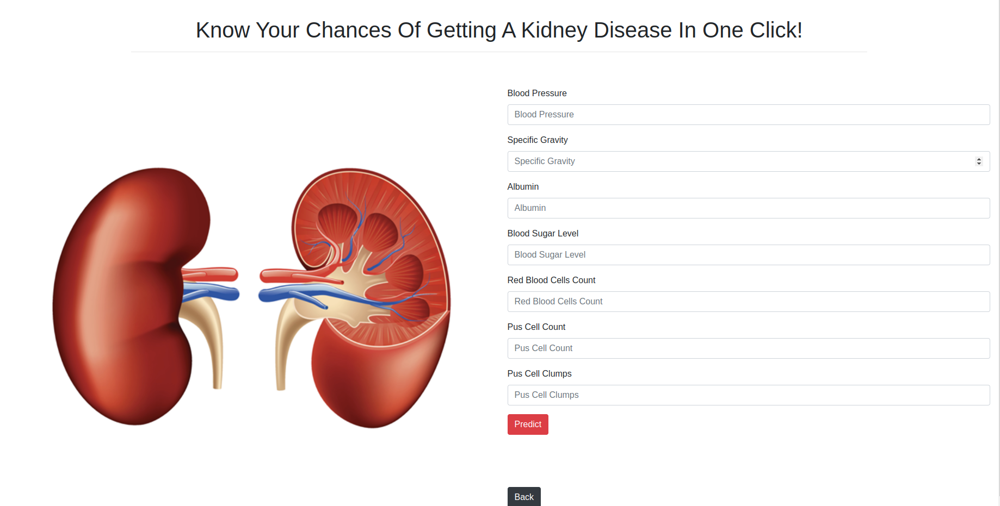

# SearchAi College Project

This project consist of ten apps, where first I trained Machine Learning and Deep Learning model.
After that I deploy them using Flask.

## Applications

- Heart Disease
- Kidney Disease
- Diabetes
- Liver Disease
- Breast Cancer
- Number Detector
- Spam Detector
- Restaurant Review
- Image Classifier
- House Price

## Screenshots

### Home Page

### Main Page

### Disease

### Number Detector

### Spam Detector

### Image Classifier

### House Price Prediction

## Installation

**You need to install these frameworks/libraries and envirnoments to write codes in your machine:**

- Visual Studio/ Atom/ PyCharm ...
- Mongodb
- Python
- Flask
- Flask_pymongo
- Numpy
- Pandas
- Matplotlib
- Seaborn
- Sklearn
- Xgboos
- Joblib
- Pickle
- Tensorflow

## 🚀 About Me

I'm a full time student in the field of computer application at Bangalore University.
I got into AI/ML and DL at the end of 2020. So I made a road map for myself to learn
about AI. Special thank from ML communities for providing amazing topics
related to this are. Dreaming for using AI in heathcare due to coming from medicine background :).
